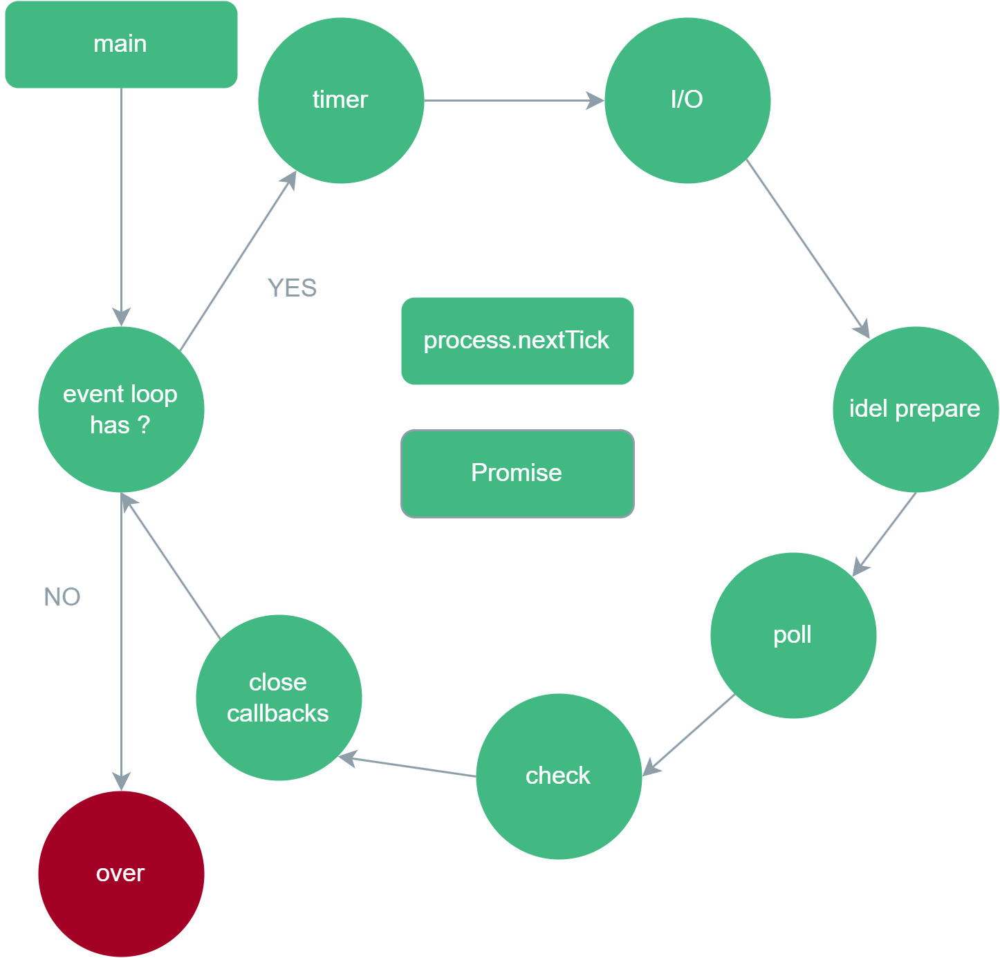

# 2024.3.29 宁波公司面试

## React 16 17 18 等各个版本的区别？

React 15 中使用reconceiler(协调器)来进行diff找到变化节点后通知renderer渲染 递归更新子组件

**React 16** :

相较于15版本有重大的更新，包括新的特性/新的Fiber架构/Hooks。

- 支持返回字符串和数组。16以前render函数只能返回一个元素，如果需要返回多个元素就要再外层包裹一层div,16中就不需要。
- 新增componentDidCatch生命周期和getDerivedStateFromError方法，可以捕获组件内部错误而不会导致页面崩溃。
- 新增createPortal方法，可以将组件渲染到指定的DOM节点上。
- 新增Fragment，可以用来替代div但是不会渲染到页面上，避免了添加额外的节点。
- 新增createRef/forwardRef用于转发ref，可以将ref传递给子组件。
- 新增context api 用于跨层级传递数据。
- 新增Strict Mode 用于检测项目中可能出现的问题。
- 新增memo组件用于优化性能。
- 新增lazy/suspense api 用于实现懒加载。
- 16.8中引入了hooks, 让函数组件可以拥有状态，实现和类组件相同的功能。

**React 17** :

相较于16版本，17更多的是对16的优化。

- 移除事件池机制。16中事件处理函数是异步执行的，这会导致它内部获取不到事件对象，为了避免事件对象被回收，需要使用`event.persist()`来获取它，而17中事件处理函数是同步执行的，可以直接使用事件对象。
- 更改了事件委托的根节点。所有的事件都绑定再root element上，而16中都绑定再html元素上，避免多个react应用嵌套可能造成的冲突。
- 新增JSX转换器，可以在不引入React的情况下使用JSX语法。
- 副作用的清理时机。 17之前的useEffect的cleanup函数是同步执行的，这可能会减缓屏幕的过渡（例如切换标签），17中的cleanup函数是异步执行的，组件卸载后，cleanup会在屏幕更新后执行。另外，react17中会在任何新的副作用执行之前执行所有的cleanup函数（针对所有组件），而16中这种顺序只在组件内部得以保证。
- 返回一致的undefined错误，17中不仅对函数组件和类组件返回undefined进行报错，同时也对forwardRef和memo返回undefined进行报错。

**React 18** :

相较于17版本，18引入了并发模式、自动批处理、更多的hooks、SSR的支持。

- 新增Concurrent Mode （并发模式）并默认开启，让渲染更加流畅。在16.8之前，state改变后经过一系列的处理进入diff过程。diff采用了DFS来遍历虚拟DOM树，这个过程是一次性完成的，而当应用很复杂元素很多时，diff过程就会长时间占用主线程。如果diff比较的时间超过16.6ms就会出现掉帧，如果时间更长则会造成卡顿。而在并发模式下，diff是可以中断的。如果diff时间超过5ms，React就会将主线程交还给浏览器去渲染，当空闲的时候，利用事件循环机制恢复diff。并发模式下的中断和恢复机制是scheduler提供的。

```jsx
// v17
import ReactDOM from 'react-dom'
import App from './App'

ReactDOM.render(<App />, document.getElementById('root'))

// v18
import ReactDOM from 'react-dom/client'
import App from './App'

ReactDOM.createRoot(document.getElementById('root')).render(<App />)

```

1. 实现自动批处理。自动批处理就是将多次的状态更新聚合到一次render中执行避免多次重新渲染以提升性能。17版本中的批处理只在事件处理函数中实现，而在异步代码、原生事件处理函数中失效，18版本则优化为所有的更新都会自动进行批处理。（如果某些场景不需要批处理，可以使用flushSync强制同步更新，flushSync是以函数为作用域，内部如果有多个setState依然是批量更新）。
2. Suspense支持SSR。SSR页面渲染流程：服务器获取页面所需要的数据->将组件渲染成HTML字符串并返回给客户端->客户端通过水合将HTML字符串渲染成页面。这一过程是串行的，18版本之前的SSR不允许组件等待数据，必须得所有得数据都收集完成才会向客户端响应HTML，如果其中某一环节比较耗时，整体得渲染速度就会变慢。18版本中使用并发渲染特性拓展了Suspense,支持流式SSR，也就是将组件分割成更小得块，允许服务器一点一点响应HTML，尽早发送HTML和选择性地水合，从而提高页面地加载速度。
3. 新增了startTransition。这个方法可以将更新作为一个transition，React会将它视为可中断任务，允许用户在不阻塞UI地情况下更新状态。本质上用于一些不紧急的更新上，用来进行并发控制。
4. 新增了useTransition。这个hook提供了一个变量isPending和startTransition，isPending用于追踪transition的状态。
5. useDeferredValue。它和useTransition一样都是标记一次非紧急更新，不同的是useTransition处理一段逻辑，而它是产生一个新的状态，这个状态是延时的，因此它可以推迟状态的渲染。
6. 新增useId。这个hook支持同一个组件在客户端和服务端生成相同的ID，避免水合的不匹配，原理就是每个ID代表了该组件在组件树中的层级结构。
7. 新增useSyncExternalStore。一般是第三方状态管理使用，它通过强制的状态同步更新，使得外部store可以支持并发读取。它实现了对外部数据源订阅时不再需要useEffect。
8. 新增useInsertionEffect。仅限于 css-in-js 库使用。它允许 css-in-js 库解决在渲染中注入样式的性能问题。 执行时机在 useLayoutEffect 之前，只是此时不能使用 ref 和调度更新，一般用于提前注入样式。

## 说一下Fiber Node？为什么Fiber要使用链表结构？

Fiber就是React内部实现的用于状态更新的数据结构，支持优先级调度和异步可中断。

Fiber Node是Fiber树的最小单元，一个Fiber Node对应一个React Element,同时它也是一个最小的工作单元，保存了节点的属性、更新变化、hooks、父节点/子节点/兄弟节点的引用等等。

Fiber实现了双缓存机制，也就是说同时存在两个Fiber树，一个current fiber树和一个workInProgress fiber树，current树用于当前的渲染更新，另一个在内存中用于下一次更新，当某个Node发生变化后且workInProgress树更新完后，fiberRootNode就会指向workInProgress树的rootFiber，这样workInProgress树就变成了current树，同时之前的current树就成为了workInProgress树。

```js
// 源码
function FiberNode(
  this: $FlowFixMe,
  tag: WorkTag,
  pendingProps: mixed,
  key: null | string,
  mode: TypeOfMode,
) {
  // Instance
  this.tag = tag;
  this.key = key;
  this.elementType = null;
  this.type = null;
  this.stateNode = null;

  // Fiber Node和Fiber Node之间的关系
  // Fiber
  this.return = null; // 父节点
  this.child = null;
  this.sibling = null;
  this.index = 0;

  this.ref = null;
  this.refCleanup = null;

  this.pendingProps = pendingProps;
  this.memoizedProps = null;
  this.updateQueue = null; //更新队列，该节点内部的更新顺序
  this.memoizedState = null;
  this.dependencies = null;

  this.mode = mode;

  // Effects
  this.flags = NoFlags;
  this.subtreeFlags = NoFlags;
  this.deletions = null;

  this.lanes = NoLanes;
  this.childLanes = NoLanes;

  this.alternate = null; // 指向内存中的workInProgressFiber树对应的Node
}


```

## 说一下Nodejs中的事件循环？它和浏览器中的事件循环有什么区别？

区别：

1. 浏览器的事件循环是根据HTML标准实现的，而nodejs中的事件循环是基于libuv实现的。libuv是一个C语言实现的高性能解决单线程非阻塞异步 I/O 的开源库，它本质上是对常见操作系统底层异步I/O操作的封装，nodejs底层就是调用它的API。
2. 浏览器中的事件循环和Nodejs中的事件循环都将异步任务划分为宏任务和微任务。
  浏览器微任务： Promise.then() 、 MutationObserver。
  浏览器宏任务： setTimeout/setInterval、 script（整体代码） 、 UI事件 、Postmessage 、 MessageChannel。
  NodeJS微任务： Promise.then、process.nestTick。
  NodeJS宏任务： setTimeout、setInterval、 setImmediate、script（整体代码）、 I/O 操作。

览器中的事件循环：首先脚本本身的执行就是一个宏任务，在执行同步代码时遇到微任务就将它加入微任务队列（FIFO），遇到宏任务就加入宏任务队列(FIFO)，当本次脚本的同步代码执行完毕（卡可以看作是一个宏任务结束），就查看微任务队列并依次执行，执行一个微任务就移除微任务队列直到微任务队列执行完毕；接着查看宏任务队列，依次执行。整体执行效果就是一个循环，宏任务->微任务 -> 宏任务。

如果在一轮事件循环中，微任务和宏任务队列都为空，那么主线程会进入idle状态（休眠），此时会保持轮询事件循环，等待响应新的事件（用户输入交互，定时器到期）。

NodeJS中的事件循环：划分为六个阶段，也就是有六个宏任务队列，而微任务队列有两个process.nextTick队列和Promise队列，它们在进入下一个阶段前必须依次反复清空，直到两个队列完全没有即将到来的任务的时候再进入下一个阶段。process.nextTick队列的优先级高于Pormise队列。

1. timer阶段。执行setTimeout/setInterval的回调，由poll阶段控制。
2. I/O callbacks阶段。处理上一轮循环poll阶段中未执行而延迟的I/O回调。
3. idle/prepare阶段。仅Node内部使用。
4. poll阶段。回到timer阶段执行回调，然后执行I/O回调。在进入poll阶段之前会计算poll阶段的超时时间。如果poll队列有回调任务，依次执行直到队列清空；如果poll队列中没有回调任务，则判断：如果有setImmediate回调需要执行，poll阶段会结束并进入check阶段；如果没有setImmediate回调需要执行，会等待其他队列的回调被加入到poll队列中并立即执行，等待时间如果超过设定的时间则进入下一次事件循环。如果没有其他队列的回调会被加入poll队列，则结束该阶段，并在本轮事件循环结束后退出node程序。
5. check阶段。执行setImmediate回调。
6. close callbacks阶段。执行执行所有注册 close 事件的回调函数。



## Webpack做过哪些优化？

（个人使用不多，主要使用Vite）

使用webpack 5.0以上的版本，更好的打包构建性能。

优化打包速度：

1. 多线程/多实例构建： thread-loader
2. 缩小打包的作用域：例如使用exclude/include确定loader的规则范围；resolve.modules指明第三方模块的绝对路径，减少不必要的查找；resolve.extensions 尽可能减少后缀尝试的可能性。
3. 减少执行构建的模块；合理设置noParse,忽略没有模块化的文件（没有import、require、define等语句）；合理配置IgnorePlugin，在构建时删除不需要的模块；合理配置externals,它会告诉webpack无需打包哪些库文件；合理设置loader的include/exclude，只对特定的模块使用Loader。
4. 充分利用缓存提升二次构建的速度：babel-loader开启缓存；使用cache-loader、terser-webpack-plugin(v5版本自带)；webpack5 配置 cache.type开启磁盘缓存
5. 使用DLLPlugin进行分包，使用 DllReferencePlugin(索引链接) 对 manifest.json 引用，让一些基本不会改动的代码先打包成静态资源，避免反复编译浪费时间。

优化构建结果：

1. 压缩代码：使用html-webpack-plugin压缩html;使用 optimize-css-assets-webpack-plugin或者css-minimizer-webpack-plugin（v5）压缩css；使用terser-webpack-plugin压缩js；使用image-webpack-loader压缩图片。
2. 代码分割。
3. Tree shaking。打包时在确保不影响功能的前提下删除没有使用的代码。
4. GZIP。使用compression-webpack-plugin对静态资源进行gzip压缩。
5. 作用域提升。生产环境下默认开启。

## 说一下Koa的洋葱模型？

洋葱模型就是以next函数为分割点，由外到内地一层层执行中间件，等最内层执行结束后再由内到外执行中间件，通过洋葱模型将多个中间件之间地通信变得更加可控和简单。
