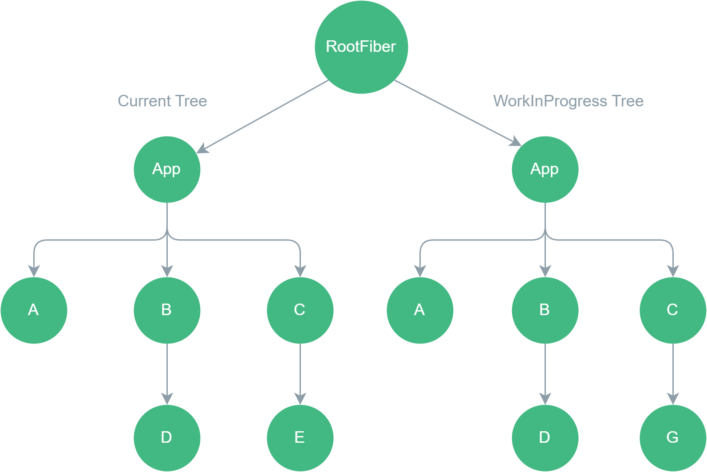
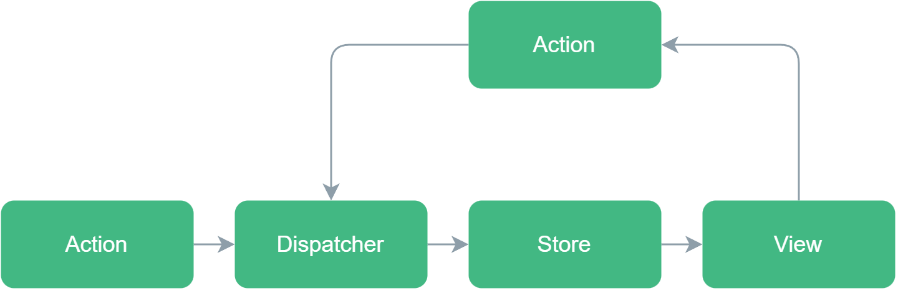

<script setup>
import Tag from '../components/Tag.vue'
</script>

# React

## React 合成事件和原生事件的区别？

- 名称不同：原生事件名称都是小写，合成事件的名称是驼峰式的。
- 使用方式不同：原生直接使用字符串绑定，合成事件使用大括号绑定。
- 阻止浏览器默认行为： 原生的事件函数返回 false ，合成事件使用 preventDefault()。
- 事件对象不同，React 合成事件的事件对象可以通过 nativeEvent 属性访问原生事件对象。
- React 合成事件没有像原生事件一样直接绑定到对应的 DOM 上，而是利用事件委托和事件冒泡统一注册在顶层（document/root element）。

那为什么 React 要使用合成事件？

1. 抹平兼容性差异。
2. 实现跨平台。
3. 可以自定义事件。
4. 优化，利用事件委托都将事件代理到 document/root element，减少内存开销。
5. 干预事件的分发，依托 fiber 架构可以干预事件的分发来提升用户体验。

## React 的组件生命周期有哪些？

- 挂载阶段：组件首次被创建挂载到 DOM 中。

- 更新阶段：组件的 props 或 state 发生变化时触发重新渲染。

- 卸载阶段：组件从 DOM 中移除。

函数组件中没有生命周期的概念，只有类组件才有生命周期，但是可以通过`useEffect`模拟生命周期的行为。

::: code-group

```js [组件挂载阶段]
// 类组件
class App extends React.Component {
  constructor(props) {
    super(props);
    this.state = { count: 0 };
  }

  componentDidMount() {
    console.log("组件挂载完成");
  }

  render() {
    return <div>{this.state.count}</div>;
  }
}

// 函数组件
function App() {
  const [count, setCount] = useState(0);

  useEffect(() => {
    console.log("组件挂载完成");
  }, []);

  return <div>{count}</div>;
}
```

```js [组件更新阶段]
// 类组件
class App extends React.Component {
  constructor(props) {
    super(props);
    this.state = { count: 0 };
  }

  componentDidUpdate(prevProps, prevState) {
    console.log("组件更新完成");
  }

  render() {
    return <div>{this.state.count}</div>;
  }
}

// 函数组件
function App() {
  const [count, setCount] = useState(0);

  useEffect(() => {
    console.log("组件更新完成");
  }, [count]);

  return <div>{count}</div>;
}
```

```js [组件卸载阶段]
// 类组件
class App extends React.Component {
  constructor(props) {
    super(props);
    this.state = { count: 0 };
  }

  componentWillUnmount() {
    console.log("组件卸载完成");
  }

  render() {
    return <div>{this.state.count}</div>;
  }
}

// 函数组件
function App() {
  const [count, setCount] = useState(0);

  useEffect(() => {
    return () => {
      console.log("组件卸载完成");
    };
  }, []);

  return <div>{count}</div>;
}
```

:::

## 为什么使用 Hooks?Hook 的作用是什么？

React Hooks 是 React 16.8 引入的重大特性，它允许函数组件使用状态（state）、生命周期等原本只有类组件才有的能力。Hooks 的出现解决了类组件的诸多痛点，并带来了更简洁、灵活的代码组织方式。以下是它的核心优势和作用：

1. 更好地复用逻辑，避免像类组件中通过 HOC 或者 render props 来复用逻辑导致的“嵌套地狱”。

2. 更好地组织代码逻辑，避免像类组件中在`componentDidMount`、`componentDidUpdate`、`componentWillUnmount`中分散代码。

3. class 组件的 this 不易理解，需要手动绑定，给使用者造成额外的心智负担。

## React 内置的 Hooks 有哪些？

16.8 版本引入的 hooks:

- `useState`: 用于在函数组件中添加局部状态。<Tag text="常用"  />
- `useReducer`: 用于管理复杂的状态逻辑，类似于 Redux 的 reducer。<Tag text="常用"  />
- `useEffect`: 用于在函数组件中执行副作用操作（如数据获取、订阅、手动 DOM 操作等）。<Tag text="常用"  />
- `useLayoutEffect`: 与 useEffect 类似，但在 DOM 更新后同步执行，适用于需要直接操作 DOM 的场景。<Tag text="常用"  />
- `useContext`: 用于访问 React 的上下文（Context）。<Tag text="常用"  />
- `useRef`: 用于创建一个可变的引用对象，通常用于访问 DOM 元素或存储可变值。<Tag text="常用"  />
- `useMemo`: 用于缓存计算结果，避免在每次渲染时都重新计算。<Tag text="常用"  />
- `useCallback`: 用于缓存回调函数，避免在每次渲染时都创建新的回调。注意，本质上，React内部是通过`useMemo`来实现的`useCallback`。<Tag text="常用"  />

```ts
// 缓存函数
const fn = useCallback(() => {
    doSomethings()
},[])
// 等价实现
const fn = useMemo(() => {
  return () => {
    doSomethings()
  }
},[])
```

- `useImperativeHandle`: 用于自定义暴露给父组件的值，通常与 `forwardRef` 一起使用。

18 版本新引入的 hooks:

- `useDeferredValue`: 延迟更新 UI 的一部分。
- `useTransition`: 用于标记某些状态更新为“过渡”状态，并在后台渲染部分 UI。
- `useId`: 用于生成唯一的 ID，可以生成传递给无障碍属性的唯一 ID。
- `useSyncExternalStore`: 用于订阅外部存储（如 Redux 或 Zustand）的状态。
- `useInsertionEffect`: 专为 CSS-in-JS 库的作者特意打造的，在布局副作用触发之前将元素插入到 DOM 中。
- `useDebugValue`: 允许开发者在 React 开发者工具中为自定义 Hook 添加标签。

19 版本新引入的 hooks:

- `useOptimistic`: 乐观地更新用户界面。<Tag text="v19" />
- `useFormStatus`: 根据某个表单动作的结果更新 state。

详细介绍请[👉 查看官方文档](https://react.dev/reference/react/hooks)

## 为什么 React 推荐只在顶层使用 Hooks？

::: details React 文档

Don't call Hooks inside loops, conditions, nested functions, or try/catch/finally blocks. Instead, always use Hooks at the top level of your React function, before any early returns. You can only call Hooks while React is rendering a function component.

不要在循环/条件/嵌套函数/`try`/`catch`/`finally` 块中调用 Hooks。相反，请始终在 React 函数的顶层使用 Hooks，在任何提前返回之前。你只能在使用函数式组件时调用 Hooks。

:::

和 Vue3 的 Composition API 相比，Vue 中使用 Hooks 就没有 React 这么多的限制，究其根本，在于 React 和 Vue 的设计原理不同。React 的 Hooks 基于 Fiber 架构，每一个组件内使用的 Hooks 都会在组件挂载时被加入到 Fiber 对象的 Hooks 链表中，当组件更新时，React 会依次执行这些链表中的 Hooks。而在循环/条件/嵌套函数/`try`/`catch`/`finally` 中使用 Hooks，会导致更新阶段的 Hooks 执行顺序和挂载时的执行顺序不一致，这也就导致下一次更新时找不到对应的 Hook，从而导致错误。

```tsx
function App() {
  const [count, setCount] = useState(0);
  useEffect(() => {
    console.log(`count changed to: ${count}`);
  }, [count]);

  // 正常运行
  if (true) {
    useEffect(() => {
      console.log(`Conditional effect,count changed to: ${count}`);
    }, [count]);
  }

  // 初始化正常运行，修改count时报错
  if (count > 0) {
    useEffect(() => {
      console.log(`Conditional effect,count changed to: ${count}`);
    }, [count]);
  }
  return (
    <>
      <div>{count}</div>
      <button onClick={() => setCount((prev) => prev + 1)}>
        Change Counter
      </button>
    </>
  );
}
```

当修改 count 时，错误如下:

::: danger 错误信息

Warning: React has detected a change in the order of Hooks called by App. This will lead to bugs and errors if not fixed. For more information, read the Rules of Hooks:

| Index | Previous render | Next render |
| :---: | :-------------: | :---------: |
|   1   |    useState     |  useState   |
|   2   |    useEffect    |  useEffect  |
|   3   |    useEffect    |  useEffect  |
|   4   |    undefined    |  useEffect  |

:::

从错误信息就可以看到，`state`的修改导致组件重新渲染，而在渲染阶段加入了新的`useEffect`, 导致`Current Tree`和`WorkInProgress Tree`的`effect`链表不一致（参考 React Diff 原理）。而如果在组件挂载阶段就能加入 Hooks 链表并在后续的更新中不改变 Hooks 的执行顺序，则不会报错。

**总结**：只要能保证不修改 Hooks 的执行顺序，就可以在循环/条件/嵌套函数/`try`/`catch`/`finally` 等语句块中使用 Hooks，但是**非常不推荐**这样使用。

## useEffect 和 useLayoutEffect 的区别 以及使用场景

```js
useEffect(() => console.log("组件更新时执行")); // 类似于componentDidUpdate

useEffect(() => {
  console.log("组件挂载时执行"); // 类似于componentWillMount
  return () => {
    console.log("组件卸载时执行"); // 类似于componentWillUnmount
  };
}, []);

useEffect(() => {
  console.log("组件挂载时或者依赖变更时执行"); // 类似于componentWillMount加上componentDidUpdate
  return () => {
    console.log("组件卸载时或者依赖变更时执行"); // 依赖变化时会先使用旧的state和props执行该函数，然后再执行setup回调函数
  };
}, [deps]);
```

`useLayoutEffect`的用法和`useEffect`一样，但是它们的 setup 回调执行的时机不同：

VDOM 更新 -> DOM 更新 -> `useEffect`

VDOM 更新 -> `useLayoutEffect` -> DOM 更新

**useEffect**的使用场景：

1. 副作用与 DOM 无关，例如数据获取、订阅操作等。
2. 不需要立即同步读取或更改 DOM。使用`useEffect`读取和更改 DOM 可能会出现闪烁。
3. 性能优先。使用`useEffect`性能影响较小，不会阻塞浏览器的渲染，而`useLayoutEffect`则会。

**useLayoutEffect**的使用场景：

1. 需要立即同步读取或更改 DOM。例如在渲染之前需要获取元素的大小或位置等属性并做修改。
2. 防止闪烁。
3. 模拟生命周期方法。使用`useLayoutEffect`可以模拟 `componentDidMount`、`componentDidUpdate`和`componentWillUnmount`的同步行为。

## Fiber 架构的原理和工作模式？

React 执行流程：JSX -> `React.createElement()` -> Fiber Node -> DOM render

1.**什么是 fiber?**

我们编写的 JSX 代码会被 React 在底层使用`createElement`转换为 JS 对象，这个对象就是虚拟 DOM，16.8 后 React 实现了一套新的调度算法，使用到的结构就是 fiber 树（类似于虚拟 DOM 树，但同时也就有链表的结构），Fiber 树也是用来描述 DOM 结构的，它的每个节点就是 Fiber Node，代表了一个工作单元，包含了组件相关的信息，同时它还是 React 调度和更新机制的核心组成。

Fiber 结构如下源码所示，Fiber 也可以理解为更加强大的虚拟 DOM ：

```js
function FiberNode(
  this: $FlowFixMe,
  tag: WorkTag,
  pendingProps: mixed,
  key: null | string,
  mode: TypeOfMode
) {
  // 基本属性
  this.tag = tag; // 描述当前Fiber的启动模式的值（LegacyRoot = 0; ConcurrentRoot = 1）
  this.key = key; // React key Fiber的唯一标识
  this.elementType = null; // React元素的类型
  this.type = null; // 组件类型
  this.stateNode = null; // 如果是类组件，它指的是类的实例；如果是DOM元素，它就是对应的DOM节点。

  // Fiber 之间的关系
  this.return = null; // 指向父fiber
  this.child = null; // 指向第一个子fiber
  this.sibling = null; // 指向兄弟fiber
  this.index = 0; // 子fiber中的索引位置

  this.ref = null; // 如果组件上有ref属性，则该属性指向它
  this.refCleanup = null; // 如果组件上的ref属性在更新中被删除或更改，此字段会用于追踪需要清理的旧ref

  // Props & State
  this.pendingProps = pendingProps; // 正在等待处理的新props
  this.memoizedProps = null; // 上一次渲染时的props
  this.updateQueue = null; // 一个队列，包含了该Fiber上的状态更新和副作用
  this.memoizedState = null; // 上一次渲染时的state
  this.dependencies = null; // 该Fiber订阅的上下文或其他资源的描述

  //工作模式
  this.mode = mode; //// 描述Fiber工作模式的标志，例如Concurrent mode、Blocking mode。

  // Effects
  this.flags = NoFlags; // 描述该Fiber发生的副作用的标志（十六进制的标识）
  this.subtreeFlags = NoFlags; // 描述该Fiber子树中发生的副作用的标志（十六进制的标识）
  this.deletions = null; // 在commit阶段要删除的子Fiber数组

  this.lanes = NoLanes; // 与React的concurrent mode 有关的调度概念。
  this.childLanes = NoLanes; // 与React的concurrent mode 有关的调度概念。

  this.alternate = null; // Current Tree和WorkInProgress Tree的互相指向对方tree里的对应单元
}
```

2.**为什么需要 Fiber?**

16.8 版本之前的 React 使用递归的方式处理组件树更新（堆栈调和 Stack Reconciliation），这种方式一旦开始就无法中断，直到整个组件树被遍历完。在处理复杂结构和海量数据的情况下可能会导致主线程被阻塞，使得应用无法及时响应用户的交互或者其他高优先级的任务。而 Fiber 树则同时具有链表结构，React 在处理每一个 Fiber 节点时都会判断是否有足够的时间完成这个节点的工作，并在必要时中断和恢复。

3.**Fiber 工作原理**

借由 Fiber Node 的结构可以看出，整个 Fiber 树实际上是一个链表树，既有链接属性，又有树的结构。得益于这样的特性，使得 React 在遍历整棵 Fiber 树时可以知道从哪里开始，哪里停止，又在哪里继续，这就是 Fiber 树可以中断和恢复的前提条件。其中的`memoizedProps`、`pendingProps` 和 `memoizedState` 字段让 React 知道组件的上一个状态和即将应用的状态。通过比较这些值，React 可以决定组件是否需要更新，从而避免不必要的渲染，提高性能。`flags` 和 `subtreeFlags` 字段标识 Fiber 及其子树中需要执行的副作用，例如 DOM 更新、生命周期方法调用等。React 会积累这些副作用，然后在 Commit 阶段一次性执行，从而提高效率。

除此之外，React 还实现了**双缓冲机制**。简单来讲，React 在更新时会根据现有的 Fiber 树（current tree）创建一个新的 Fiber 树(workInProgress)，这个新的 Fiber 树保存在内存中，在后台更新，current tree 就是当前渲染在界面上的视图，它是 RootFiber 这个节点的子树。 当 workInProgress tree 完成更新后，RootFiber 就指向了 workInProgress tree, 此时 workInProgress tree 就成为了 current tree， 它被渲染到界面上，而旧的 current tree 则变成了 workInProgress tree。正是由于 React 同时维护着两棵 Fiber 树，所以可以随时进行比较、中断和恢复，也使得 React 拥有优秀的渲染性能。



4.**Fiber 的工作流程**

两个阶段，调和(Reconciliation)阶段和提交(Commit)阶段。

调和阶段 —— 确定哪些部分的 UI 需要更新，通过在构建 WorkInProgress Tree 的过程中比较新旧 Props 和旧 Fiber 树来确定。这个阶段同样需要遍历 Fiber 树，它为什么比老版本的递归遍历要高效和快速呢？得益于 Fiber Node 中`flags` 或 `subtreeFlags`字段，它们是 16 进制的标识，通过按**位或运算**后可以记录当前 Fiber 节点和子树的副作用类型，在当前 Fiber 节点和子树的副作用都为`null`时则不用继续递归，直接复用节点和子树。

提交阶段 —— 更新 DOM 并执行任何副作用，通过遍历调和阶段创建的副作用列表实现。当进入提交阶段后，React 无法进行中断。

## setState 的原理和机制？它为什么是异步的？

React 18版本中 `setState` 默认是**异步/批量**的，18版本以前在原生 DOM 事件回调中和 `setTimeout`/`promise` 回调中 `setState` 是同步执行的，即可以在执行 `setState` 后立即拿到最新值，而在 React 合成事件和生命周期中是异步执行的。

异步：setState 后面代码无法在 setState 后立即拿到最新的 state，它表现得像异步执行，**实际上不是传统意义上的异步执行（setTimeout/Promise）**。

批量：连续多次调用 setState 会合并成一个更新操作，UI 只会重新渲染一次。


原理：

- fiber 架构之前： 执行`setState` -> 合并状态数据到组件的状态队列中，不立即执行 -> 根据新的状态数据生成一个新的虚拟 DOM 树，表示预期的输出结果 -> 比较新旧虚拟 DOM 树确定需要进行的实际 DOM 更新 -> 计算两棵树的差异，这些差异代表对实际 DOM 进行的最小更改 -> 批处理更新实际的 DOM

- fiber 架构之后：执行`setState` -> 将更新请求放入队列中，不立即执行，继续后续的任务 -> 进入调度阶段，生成新的 fiber 树（workInprogress 树），用于描述预期的输出 -> 比较 workInprogress fiber 树和当前渲染使用的 fiber 树，确定需要的实际 DOM 更新 -> 计算两个 fiber 树的差异，这些差异代表对实际 DOM 进行的最小更改 -> 将计算出的差异转换为更新队列，队列包含需要更新的组件和 DOM 节点 -> 优先级调度，确保重要的任务优先执行 -> 按照优先级顺序执行更新队列中的任务来批量处理更新实际 DOM。

设计成异步的理由：

1. 提升性能，避免每次调用`setState`都重新渲染组件。（性能损耗一般在虚拟 DOM 树 diff 过程）
2. 避免`state`和`props`无法同步。如果`setState`是同步执行的，那么就会立即更新组件内部的`state`，但是 render 函数中传递的`props`还是旧值，这就导致了`state`和`props`的不一致。

## setState 批量更新是如何实现的？

React 中 `setState` 的批量更新特性核心是通过**React Scheduler**来实现的，具体处理逻辑在 `enqueueSetState` 函数中。

当在组件中多次调用`setState`时，React 并不会立即更新组件的状态，而是通过**React Scheduler**将状态更新请求添加到一个队列中，然后在合适的时机(一般是JS运行栈清空，事件循环即将开始下一轮时)处理队列中的更新请求。

```ts
function batchedUpdates<A, R>(fn: (a: A) => R, a: A): R {
  // 当前是否 批量更新赋值到 previous 状态上
  const previousIsBatchingUpdates = isBatchingUpdates;
  isBatchingUpdates = true;
  try {
    return fn(a); // 这里调用的是事件处理函数
  } finally {
    // 将过去上一次更新的 previous 存到全局变量 BatchingUpdates 上
    isBatchingUpdates = previousIsBatchingUpdates;
    // 当不是批量更新 而且不是在渲染阶段，那么state的值将会一次更新，调用 performSyncWork
    if (!isBatchingUpdates && !isRendering) {
      performSyncWork(); // 直接同步一起更新
    }
  }
}
```

这种批量更新的机制可以确保在一个更新周期内，只进行一次更新操作，从而避免不必要的重复渲染。这对于性能优化至关重要，特别是在处理大量状态更新时。

## useRef 的原理和机制？为什么它不会导致 UI 重新渲染？/为什么它的值在组件的生命周期中是不变的？

`useRef`函数接受一个初始值 initialValue，并返回一个可变的 ref 对象，这个对象上面存在一个属性 current，默认值就是 initialValue。和`useState`不同的是，`useState`返回的是不可变的值，每一次 render 都是新值，而 ref 对象在组件的生命周期中不会改变，其 current 属性可以被赋任意值，也就是说无论何时访问 ref 对象都能获取到最新值。

当初始化`useRef`时实际是调用内部的`mountRef`方法，流程如下：

```ts
function mountRef<T>(initialValue: T): {|current: T|} {
  const hook = mountWorkInProgressHook();
  const ref = {current: initialValue};
  hook.memoizedState = ref;
  return ref;
}
```

1. 调用**mountWorkInProgressHook**创建一个 React 内部的 hook 对象，并按照顺序加入到构建的 hook 链表中。
2. 创建一个 ref 对象，将初始化值赋值给该对象的 current 属性。
3. 将 ref 对象存储在 hook 对象的`memoizedState`属性上。
4. 最后返回 ref 对象。

当修改 ref 对象的 current 值时，流程如下：

```ts
function updateRef<T>(initialValue: T): {|current: T|} {
  const hook = updateWorkInProgressHook();
  return hook.memoizedState;
}
```

1. 通过`updateWorkInProgressHook`方法拿到函数组件加载时对应的 hook 对象。
2. 返回 hook 对象的`memoizedState`属性值。

通过上面原理可以知道，组件更新时引用的对象永远是同一个 ref 对象， 而不会重新创建新的 ref 对象。这是因为 hook 对象都是存储在组件的 fiber 对象上，这确保了 ref 对象不可变，这样在组件的生命周期内 ref 对象的 current 值永远都是被赋值的最新值，除了手动修改 current 值之外它是不会改变的。

## React 事件处理机制是怎么样的？16 和 17 版本又有什么不同？

React 自己实现了一套事件系统，它的事件是合成事件，主要的目的是抹平不同浏览器之间的兼容性差异。

机制总结： **顶层注册，存储回调，事件派发**。

**顶层注册**：React 合成事件机制采用了事件委托的思想。在 React 组件挂载时会根据组件内声明的事件类型（onClick,onChange 等）在 document 上注册相应依赖的原生事件（使用 addEventListener 注册，17 版本后则是在 root element 上注册），并且捕获阶段和冒泡阶段的事件都会注册。在注册事件时会指定统一的回调函数 dispatchEvent,也就是说同一种类型的事件它的回调函数是一样的，这样就减少了内存开销。

**存储回调**： React 为了在触发事件时可以查找到实际对应的回调函数去执行，会把组件内的所有事件统一地存放到一个对象中（listenerBank）。而存储方式如下所示，首先会根据事件类型分类存储，例如 click 事件相关的统一存储在一个对象中，回调函数的存储采用键值对（key/value）的方式存储在对象中，key 是组件的唯一标识 id，value 对应的就是事件的回调函数。

```js
// listenerBank
{
  click: {
    key1: fn,
    key2: fn,
    ...
  }
  change:{
    key1:fn,
    key2:fn,
    ...
  }
}
```

**事件派发**： React 的事件触发只会发生在 DOM 事件流的冒泡阶段，因为注册时默认在冒泡阶段执行。流程如下：

1. 触发事件，开始 DOM 事件流，事件捕获 -> 处于目标阶段 -> 事件冒泡。
2. 当事件冒泡到 document（17 版本是 root element）时，触发统一的分发函数。
3. 根据原生事件对象 nativeEvent 找到当前节点（事件触发节点）对应的 React Component 对象。
4. 事件合成： 根据当前事件类型生成对应的合成对象 -> 封装原生事件对象和冒泡机制 -> 查找当前元素以及它所有父级 -> 在 listenerBank 中查找事件回调函数并合成到 events 中。
5. 批量执行合成事件（events）内的回调函数。
6. 如果没有使用**stopImmediatePropagation**方法阻止冒泡，会将继续进行 DOM 事件流的冒泡（从 document 到 window），否则结束事件触发。

::: tip
注意： 阻止冒泡如果使用 stopPropagation 方法时，当 document/root element 上还有同类型的其他事件时也会被触发执行，但是 window 上不会被执行。
:::

由此可知，由于 React 的事件委托机制，React 组件对应的 DOM 节点上的原生事件触发时机总是在 React 组件内注册的合成事件之前。

## React 为什么在处理列表时推荐使用唯一的 key 属性？这与 DIFF 算法有什么关系？

React 中需要在列表元素或动态生成元素上使用 key 属性用作元素的唯一标识，让每一个元素具有唯一性，在 DIFF 过程中通过比较新旧元素，如果有 key 相同的新旧节点时，则会执行移动操作，而不会执行先删除旧节点再创建新节点的操作，并且通过唯一 key 值可以在 DIFF 过程中快速定位对应元素，从而减少 DIFF 算法的时间复杂度，这些都大大提高了 React 的性能和效率。

## 为什么React要自己实现`requestIdleCallback`？

1. 兼容性和差异性。原生`requestIdleCallback`并非在所有浏览器中都支持，并且实现方式的差异会导致行为差异，例如，截至目前，Safari 26.0版本还未支持。React通过自己实现，可以确保在各种环境中行为一致。具体兼容性请查看[Can I Use - requestIdleCallback](https://caniuse.com/requestidlecallback)。

2. 更精细的任务调度。React的内部调度器可以根据自己的策略来优先处理任务，例如将一些不紧急的任务放在空闲时段执行，而不是完全依赖于浏览器的调度机制。

3. 与React协调机制集成。React能够更好地将空闲回调与Fiber架构以及并发模式特性配合使用，从而实现任务的中断和恢复。

4. 执行时机问题。 W3C规定，`requestIdleCallback`的回调函数执行间隔是50ms,也就是说1秒内执行20次，在20个帧之间调用，间隔较长。

总结：React自己实现`requestIdleCallback`是为了抹平浏览器差异，确保行为一致并更好地与React协调机制配合来控制任务的调度、中断和恢复。

## 说说`requestIdleCallback`的替代方案？

替代方案： `MessageChannel` + `requestAnimationFrame`，这是早期React版本中自定义调度器的实现。

```js
const channel = new MessageChannel();
let isScheduled = false;

channel.port1.onmessage = () => {
  isScheduled = false;
  doWork(); // 执行低优先级任务
};

function scheduleWork() {
  if (!isScheduled) {
    isScheduled = true;
    channel.port2.postMessage(null); // 触发 port1 的 onmessage 回调
  }
}
```

原因：

1. 兼容性更好。相比于`requestIdleCallback`，现代浏览器基本都支持`MessageChannel` 和`requestAnimationFrame`。

2. 根据**现代浏览器事件循环模型**，`MessageChannel`回调函数执行时机比`setTimeout(fn,0)`的回调函数时机更早，这让它在某些场景下可以模拟浏览器内部的异步调度行为。

3. `requestAnimationFrame`的回调函数执行时机在下一次重绘之前，同样早于`setTimeout`。利用它可以实现类似“在下一帧之前安排优先级任务”的功能。

4. 独立于浏览器内置调度机制，可以绕过`requestIdleCallback`不可用或行为不一致的问题，实现跨平台统一行为。

因此，选择它们来实现调度器，正是因为兼容性好，响应较快，可控性强，适合构建异步调度机制的基础。

## 为什么建议传递给 setState 的参数是一个 callback 而不是一个对象/值？

主要原因是`setState`是异步执行且批量更新的，建议传入 callback 而不是对象的理由如下：

1. 确保获取最新值。通过传递一个回调函数作为参数，可以确保在当前更新状态时获取到上次更新后的最新状态值。回调函数的参数是前一个状态值，可以基于该值进行计算和更新。这样可以避免依赖于旧状态值但无法获取最新值的问题。

```js
const [users, setUsers] = useState([]);

setState((prev) => [...prev, "user1"]); // prev is []

setState((prev) => [...prev, "user2"]); // prev is ['user1']
```

2.避免状态更新问题。在对相同状态进行多次更新时，`setState`会在内部将这些更新合并为一个，这就是批处理。如果多次调用`setState`时传入对象，后续的调用可能会出现覆盖前面的调用，从而导致状态更新不符合预期。

```js
const [count, setCount] = useState(0);

// 在某个场景中我需要连续增加count

function operation() {
  setCount(count + 1); // 1
  setCount(count + 1); // 1
}

function operation2() {
  setCount((prev) => prev + 1); // 1
  setCount((prev) => prev + 1); // 2
}
```

对于以上代码，`operation`中两次调用的`setState`是直接传入值进行更新，react 对于这种多次对相同状态更新的操作进行了合并，导致实际上`count`只增加了一次，而`operation2`中使用 callback 的方式进行更新，react 会将这个 callback 放入更新队列中依次执行更新，最后得出计算结果，因此`count`实际上被增加了两次。

## 简述下 flux 思想？

Flux 是一种应用程序架构思想，旨在帮助管理复杂的前端应用程序中的数据流。它最初由 Facebook 提出，用于解决 React 应用中数据流管理的问题。以下是 Flux 思想的简要概述：

- 单向数据流：Flux 架构中的核心概念是单向数据流。数据在应用中的流动是单向的，沿着固定的路径流动，这样可以更容易追踪数据的变化和管理数据流。

- 组件化：Flux 鼓励将应用程序拆分为多个独立的组件，每个组件负责特定的功能。这种组件化的设计使得代码更易于维护和扩展。

- Action：在 Flux 中，用户操作或事件会触发一个 Action，表示发生了某种行为。Action 是一个简单的对象，描述了事件的类型和相关数据。

- Dispatcher：Dispatcher 是 Flux 架构中的中心枢纽，负责接收所有的 Action，并将它们分发给注册的 Store。

- Store：Store 是应用中存储数据的地方，它负责管理应用的状态和数据。当 Store 接收到 Action 后，会根据 Action 的类型更新自己的状态，并触发视图更新。

- View：View 层负责渲染用户界面，并根据 Store 的状态更新界面。View 从 Store 中获取数据，并监听 Store 的变化以及时更新界面。

- 流程：用户操作会触发 Action，Dispatcher 将 Action 分发给 Store，Store 更新状态后通知 View 更新界面，这样形成了一个单向数据流的循环。



通过这种单向数据流的架构，Flux 提供了一种清晰的数据管理方式，使得应用程序中的数据流动更加可控和可预测。尽管 Flux 本身并不是一个具体的库或框架，但它提供了一种思想和架构模式，可以帮助开发者更好地组织和管理复杂的前端应用程序。

## React 中代码层面的性能优化手段有哪些？

一般在项目开发的前期不用太过注重性能优化的问题，首先保证功能的实现，其次在遇见性能问题时再进行相应的优化，因为如果过早地进行性能优化，可能会影响功能的开发进度，而且你不能保证后续项目不会添加新的功能，这也可能与你所做的优化手段产生冲突，进而导致返工和白忙活。因此，在项目开发的初期，我们应该关注的是功能的实现，保证项目的正常运行，然后再考虑性能优化。

React 中的代码层面的性能优化无非就是围绕**减少重新渲染，减少不必要的计算**进行，下面是一些需要注意的点：

1. 减少不必要的 state。对于和界面渲染无关的变量不要使用 state 保存，任何 state 的改变都会导致组件重新渲染。例如你需要在初始化一个 ECharts 实例后保存，它在整个声明周期中不会再改变且与界面渲染无关，那么可以使用`useRef`进行一个保存。

2. 尽可能地划分组件（细粒度），不要在一个组件中使用过多的`useState`。

3. 配合第二点，合理使用`memo`进行组件的记忆。在 React 中，只要父组件触发重新渲染，那么所有的子组件都会重新渲染，但这是不符合我们的期望的，只要接收的 props 没有变化或者没有 props，那么子组件就不应该重新渲染，此时可以使用`memo`包裹我们不希望它重新渲染的子组件来使它跳过重新渲染。如果子组件接收父组件的 props 并且只有其中某个属性会发生变化，可以在`memo`中指定对应的属性来进行比较。参考[React memo](https://react.dev/reference/react/memo#memo)。

4. 合理使用`useMemo`缓存计算结果，它是 React 提供的用于性能优化的手段，然而并不是每一个计算结果和函数都需要进行缓存，由于缓存本身存在性能开销，如果滥用反而达不到性能优化的效果。对于复杂的计算，例如基于某个 state `A`进行一个`Long Task`然后渲染到界面上，但是`A`在后续生命周期中不会频繁改变，但是另一个 state `B`会频繁被修改而导致组件重新渲染， 这种耗时计算就可以使用`useMemo`缓存，避免每次组件重新渲染都重新计算。

5. 合理使用`useCallback`缓存函数，它也是 React 提供的用于性能优化的手段。和`useMemo`一样，并非所有组件内声明的函数都需要使用`useCallback`进行包裹，如果一个函数被传递给子组件时，父组件重新渲染时即使子组件使用了`memo`也会导致子组件重新渲染，因为该函数在重新渲染时重新申明得到了一个新的引用地址，`memo`比较时不会跳过重新渲染，此时可以使用`useCallback`包裹函数，使的每次渲染后函数的引用都是一样的。也就是说，`useCallback`需要配合`memo`一起使用才能达到优化效果。

6. 避免使用内联函数，因为内联函数在每次渲染时都会重新创建，造成性能损耗。

7. 合理使用`useEffect`，避免在一个组件内使用过多的副作用（组件细粒度拆分），这不仅不利于维护，还可能导致组件的无限循环渲染。如果在`useEffect`的 setup 回调中使用了外部订阅和定时器，请在 cleanup 回调中取消订阅和移除定时器，避免造成内存泄漏。

## React19带来了哪些新特性？

1. 新的Hooks：`useActionState`,`useOptimistic`,`useFormStatus`。

2. 新的API： `use`。

3. 服务端组件可以提前渲染，与服务端Actions配对后，客户端组件可以无缝调用异步的服务端函数。

4. ref作为props对象的属性在函数组件中被使用，新的函数组件不再需要使用`forwardRef`。

5. 改进了水合错误的报告。

6. 直接使用Context作为Provider，而不再需要使用`Context.Provider`。

👉具体更新以及其他更改请查看官方Blog：[React v19](https://zh-hans.react.dev/blog/2024/12/05/react-19)
