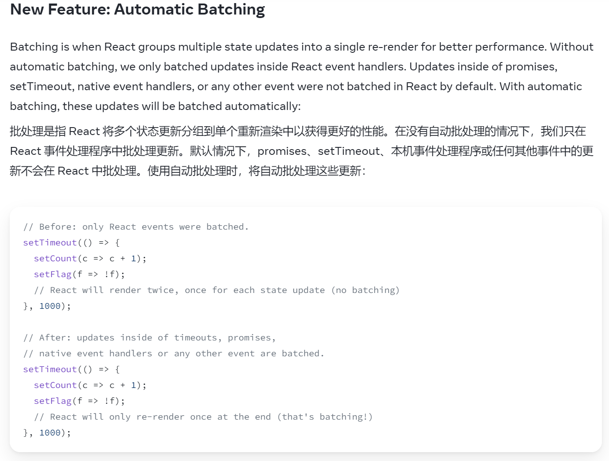

# React questions

## 1.React合成事件和原生事件的区别？

1. 名称不同：原生事件名称都是小写，合成事件的名称是驼峰式的。
2. 使用方式不同：原生直接使用字符串绑定，合成事件使用大括号绑定。
3. 阻止浏览器默认行为： 原生的事件函数返回false ，合成事件使用preventDefault()。

为什么React要使用合成事件？

配合VDOM模拟原生事件 实现跨平台 所有事件都放在一个数组中。

## 2.为什么使用hooks？

1. 复杂组件的逻辑便于抽离。
2. 复用逻辑。
3. class组件的this不易理解，给使用者造成额外的心智负担。

## 3.useEffect 和 useLayoutEffect 的执行区别

```js

useEffect(() => console.log('组件更新时执行')) // 类似于componentDidUpdate

useEffect(() => {
    console.log('组件挂载时执行'); // 类似于componentWillMount
    return () => {
        console.log('组件卸载时执行') // 类似于componentWillUnmount
    }
},[])

useEffect(() => {
      console.log('组件挂载时或者依赖变更时执行'); // 类似于componentWillMount加上componentDidUpdate
    return () => {
        console.log('组件卸载时或者依赖变更时执行') // 依赖变化时会先使用旧的state和props执行该函数，然后再执行setup回调函数
    }
},[deps])

```

useLayoutEffect的用法和useEffect一样，但是它们的setup回调执行的时机不同：

VDOM更新 -> DOM更新 -> useEffect
VDOM更新 -> useLayoutEffect -> DOM更新

## 4.Fiber架构的原理和工作模式？

JSX -> React.createElement() -> Fiber Node 

**什么是fiber?**

我们编写的JSX代码会被React在底层使用createElement转换为JS对象，这个对象就是虚拟DOM，16.8后React实现了一套新的调度算法，使用到的结构就是fiber树（类似于虚拟DOM树，但同时也就有链表的结构），fiber树也是用来描述DOM结构的，它的每个节点就是fiber node，代表了一个工作单元，包含了组件相关的信息，同时它它还是React调度和更新机制的核心组成。

Fiber结构如下源码所示，fiber也可以理解为更加强大的虚拟DOM

```js
function FiberNode(
  this: $FlowFixMe,
  tag: WorkTag,
  pendingProps: mixed,
  key: null | string,
  mode: TypeOfMode,
) {
  // 基本属性
  this.tag = tag; // 描述当前Fiber的启动模式的值（LegacyRoot = 0; ConcurrentRoot = 1）
  this.key = key; // React key Fiber的唯一标识
  this.elementType = null; // React元素的类型
  this.type = null; // 组件类型
  this.stateNode = null; // 如果是类组件，它指的是类的实例；如果是DOM元素，它就是对应的DOM节点。

  // Fiber 之间的关系
  this.return = null; // 指向父fiber
  this.child = null; // 指向第一个子fiber
  this.sibling = null; // 指向兄弟fiber
  this.index = 0; // 子fiber中的索引位置

  this.ref = null; // 如果组件上有ref属性，则该属性指向它
  this.refCleanup = null; // 如果组件上的ref属性在更新中被删除或更改，此字段会用于追踪需要清理的旧ref

  // Props & State
  this.pendingProps = pendingProps; // 正在等待处理的新props
  this.memoizedProps = null; // 上一次渲染时的props
  this.updateQueue = null; // 一个队列，包含了该Fiber上的状态更新和副作用
  this.memoizedState = null; // 上一次渲染时的state
  this.dependencies = null; // 该Fiber订阅的上下文或其他资源的描述
  
  //工作模式
  this.mode = mode; //// 描述Fiber工作模式的标志，例如Concurrent mode、Blocking mode。

  // Effects
  this.flags = NoFlags; // 描述该Fiber发生的副作用的标志（十六进制的标识）
  this.subtreeFlags = NoFlags; // 描述该Fiber子树中发生的副作用的标志（十六进制的标识）
  this.deletions = null; // 在commit阶段要删除的子Fiber数组

  this.lanes = NoLanes; // 与React的concurrent mode 有关的调度概念。
  this.childLanes = NoLanes;// 与React的concurrent mode 有关的调度概念。

  this.alternate = null; // Current Tree和WorkInProgress Tree的互相指向对方tree里的对应单元
}
```

**为什么需要fiber?**

16.8版本之前的React使用递归的方式处理组件树更新（堆栈调和 Stack Reconciliation）,这种方式一旦开始就无法中断，直到整个组件树被遍历完。在处理复杂结构和海量数据的情况下可能会导致主线程被阻塞，使得应用无法及时响应用户的交互或者其他高优先级的任务。而fiber树则是一种链表结构，React在处理每一个fiber节点时都会判断是否有足够的时间完成这个节点的工作，并在必要时中断和恢复。

 **Fiber工作原理**

借由fiber node的结构可以看出，整个fiber树实际上一个链表树，既有链接属性，又有树的结构。得益于这样的特性，使得React在遍历整棵fiber树时可以知道从哪里开始，哪里停止，又在哪里继续，这就是fiber树可以中断和恢复的前提条件。其中的memoizedProps、pendingProps 和 memoizedState 字段让React知道组件的上一个状态和即将应用的状态。通过比较这些值，React可以决定组件是否需要更新，从而避免不必要的渲染，提高性能。flags 和 subtreeFlags 字段标识Fiber及其子树中需要执行的副作用，例如DOM更新、生命周期方法调用等。React会积累这些副作用，然后在Commit阶段一次性执行，从而提高效率。

除此之外，React还实现了**双缓冲机制**。简单来讲，React在更新时会根据现有的fiber树（current tree）创建一个新的fiber树(workInProgress)，这个新的fiber树保存在内存中，在后台更新，current tree就是当前渲染在界面上的视图，它是RootFiber这个节点的子树。 当workInProgress tree完成更新后，RootFiber就指向了workInProgress tree, 此时workInProgress tree就成为了current tree， 它被渲染到界面上，而旧的current tree则变成了workInProgress tree。正是由于React同时维护着两棵fiber树，所以可以随时进行比较、中断和恢复，也使得React拥有优秀的渲染性能。


**Fiber的工作流程**

两个阶段，调和(Reconciliation)阶段和提交(Commit)阶段。

调和阶段，确定哪些部分的UI需要更新，通过在构建WorkInProgress Tree的过程中比较新旧Props和旧fiber树来确定。这个阶段同样需要遍历fiber树，它为什么比老版本的递归遍历要高效和快速呢？得益于fiber node中flags 或 subtreeFlags字段，它们是16进制的标识，通过按位或运算后可以记录当前fiber节点和子树的副作用类型，当当前fiber节点和子树的副作用都为null时则不用继续递归，直接复用节点和子树。

提交阶段，更新DOM并执行任何副作用，通过遍历调和阶段创建的副作用列表实现。当进入提交阶段后，React无法进行中断。

## 5.setState的原理和机制？它为什么是异步的？

React18中setState默认是**异步/批量**的，18版本以前在原生DOM事件回调中和setTimeout/promise回调中setState是同步执行的，可以在执行setState后立即拿到最新值，而在React合成事件和生命周期中是异步执行的。

异步：setState后面代码无法在setState后立即拿到最新的state，它表现得像异步执行，实际上不是传统意义上的异步执行（setTimeout/Promise）。

批量：连续多次调用setState会合并成一个更新操作，UI只会重新渲染一次。



原理：

- fiber架构之前： 执行setState -> 合并状态数据到组件的状态队列中，不立即执行 -> 根据新的状态数据生成一个新的虚拟DOM树，表示预期的输出结果 -> 比较新旧虚拟DOM树确定需要进行的实际DOM更新 -> 计算两棵树的差异，这些差异代表对实际DOM进行的最小更改 -> 批处理更新实际的DOM

- fiber架构之后：执行setState -> 将更新请求放入队列中，不立即执行，继续后续的任务 -> 进入调度阶段，生成新的fiber树（workInprogress树），用于描述预期的输出 -> 比较workInprogress fiber树和当前渲染使用的fiber树，确定需要的实际DOM更新 -> 计算两个fiber树的差异，这些差异代表对实际DOM进行的最小更改 -> 将计算出的差异转换为更新队列，队列包含需要更新的组件和DOM节点 -> 优先级调度，确保重要的任务优先执行 -> 按照优先级顺序执行更新队列中的任务来批量处理更新实际DOM

设计成异步的理由：

1. 提升性能，避免每次调用setState都重新渲染组件。（性能损耗一般在虚拟DOM树diff过程）
2. 避免state和props无法同步。如果setState是同步执行的，那么就会立即更新组件内部的state，但是render函数中传递的props还是旧值，这就导致了state和props的不一致。


## 6.useRef的原理和机制？为什么它不会导致UI重新渲染？/为什么它的值在组件的生命周期中是不变的？


